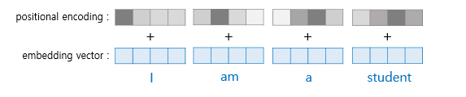

# NLP_code_assignment2 (Attention is All You Need) 

## Encoder

### concept

- 트랜스포머의 encoder는 전체 소스 문장 X를 context vector의 sequence Z로 만든다.
    - 이 때 Z를 hidden state라고 하지 않는 이유는 RNN에서 Z는 t시점 이전과 그 시점까지의 토큰들만 보게 되지만, 트랜스포머 encoder에서의 context vector들은 소스 문장의 전체 토큰을 보고 그 정보를 담고 있기 떄문이다.

- 첫 번째로 토큰들은 embedding layer를 거친다.
- 트랜스포머 encoder는 recurrent하지 않기 때문에 각 토큰이 문장에서 어떤 위치를 갖는지 알려주기 위해 두번째 positional embedding layer를 거친다.
    - <sos> 토큰은 position 0 번째이다.
    - position embedding은 입력으로 max length만큼의 사이즈를 가진다. → 이는 더 긴 문장을 받고 싶을 경우 조정하면 된다.
    - original transformer 논문은 fixed static embedding을 활용한다.
    - 그러나 BERT와 같은 Modern transformer architecture 에서는 positional embedding을 사용하기에 본 실습에서도 이 방식을 채택한다.
- 그 다음으로, 토큰들과 포지셔널 임베딩 정보는 elementwise sum되어 문장에서의 토큰과 그 포지션 정보를 얻는 벡터를 얻게 된다.
    - 토큰 임베딩과 포지셔널 임베딩이 합쳐지기 전, token embedding은 scaling factor d_model^(1/2)가 곱해진다.
    - `d_model`은 hidden dimension size로써, 스케일링을 통해 variance를 줄이게 된다.
    - 이후 elementwise sum 된 combined embeddings에는 dropout이 적용된다.
- 이렇게 얻어진 combined embedding은 N개의 encoder를 거쳐서 context vector Z를 산출한다.
- `src_mask` 는 source sentence와 shape이 갖고, `<pad>` 가 아닌 문장의 토큰들에는 1, `<pad>` 토큰 들에는 0 이 들어간다.
    - 이는 encoder layer에서 multi-head attention을 할 때 오직 source sentence들만 계산하고 어텐션을 적용하기 위해 mask를 하는 데에 사용된다.



### code

**init 함수** 

- `self**.**tok_embedding **=** nn**.**Embedding(input_dim, hid_dim)`
    - 인코더에 들어가서 첫번째로 거치게 되는 토큰 임베딩 레이어를 의미한다.
    - input_dim은 vocab size로, vocab 사이즈 만큼의 원핫 인코딩이 들어가게 되었을 때
    - hid_dim 만큼의 차원을 가지는 벡터를 반환하는 것을 알 수 있다.
    - hid_dim은 임베딩 벡터의 차원이자, 트랜스포머의 인코더와 디코더에서의 정해진 입력과 출력의 크기를 의미한다.
    - 각 인코더와 디코더가 다음 층의 인코더와 디코더로 값을 보낼 때에도 hid_dim의 차원은 유지된다.
- `self**.**pos_embedding **=** nn**.**Embedding(max_length, hid_dim)`
    - 인코더에 들어가 두번째로 거치게 되는 포지셔널 임베딩 레이어를 의미한다.
    - 입력으로는 들어오게 될 문장의 최대 길이인 max_length를 받게 되고, 이는 토큰 임베딩과 같은 차원인 hid_dim의 벡터를 반환하게 된다.

**forward 함수**

- `pos **=** torch**.**arange(0, src_len)**.**unsqueeze(0)**.**repeat(batch_size, 1)**.**to(self**.**device)`
    - pos_embedding의 입력의 텐서를 반환한다.
    - 예를 들어 max_len=5이고, batch가 2이면 아래와 같이 반환된다.
      
        ```python
        pos = [ [0,1,2,3,4], [0,1,2,3,4] ] 
        ```
    
- `src **=** self**.**dropout((self**.**tok_embedding(src) ***** self**.**scale) **+** self**.**pos_embedding(pos))`
    - token embedding과 positional embedding이 elementwise sum 되는 과정이다.
    - token embedding에는 elementwise sum이 되기 전에 hid_dim^(1/2) 만큼이 곱해져서 스케일링이 일어나게 되고
    - token embedding과 positional embedding이 elementwise sum이 된 이후에는 dropout이 적용된다.
- 이로써 인코더에 들어갈 input이 완성되었고, 아래는 각 input이 layer에 들어가게 되는 과정이다.
  
    ```
    for layerin self.layers:
          src= layer(src, src_mask)
    ```
    
    - src = [batch size, src len, hid dim] 의 차원을 가지고, src_mask=[batch size, 1, 1, src len] 의 차원을 가진다.
    - 인코더 레이어의 입력의 차원도, 출력의 차원(=디코더의 입력 차원)도 모두 동일하게 유지된다. src= [batch size, src len, hid dim]
    - 인코더 레이어의 입출력은 `src` 를 input이자 output으로 취하는 과정이다.

---

## Encoder Layer


### concept

- Encoder layer는 Encoder의 가장 핵심적인 부분이다.
- Encoder Layer에서는 다음의 단계를 거치게 된다.
    - 1) multi head attention을 지나고
    - 2) dropout, residual connection, Layer Normalization layer를 지나고
    - 3) position-wise feedforward layer를 지나고
    - 4) dropout, residual connection, layer normailization layer를 지나서 최종적으로 다음 레이어에 전달할 output을 산출한다.
        - 여기서의 output은 임베딩이 수정된 `src`이다.
        - `src=[batch size, src len, hid dim]` 의 크기를 갖고, 이는 인코더 레이어들의 입출력에서 차원이 유지된다.
- 인코더 레이어의 보다 구체적인 사항들은 다음과 같다.
    - 각 인코더 레이어들 사이에서는 파라미터가 share되지 않는다.
    - multi head attention layer는 문장 스스로에서의 attention을 계산하는 self attention layer이다.
    - layer normalization은 feature들을 normalize하는 것인데,
        - hidden dimension의 모든 feature들이 평균 0과 표준편차 1의 분포를 가지게 함으로써 매우 많은 층을 가진 트랜스포머와 같은 neural networks 이 보다 더 잘 학습될 수 있도록 한다.
        

### code

**init 함수**

- `self**.**self_attn_layer_norm **=** nn**.**LayerNorm(hid_dim)`
    - 인코더 레이어의 2)에 해당하는 레이어로, self attention layer를 거친 이후의 normalization을 진행하는 레이어를 의미한다.
- `self**.**ff_layer_norm **=** nn**.**LayerNorm(hid_dim)`
    - 인코더 레이어의 4)에 해당하는 레이어로, positionwise_feedforward를 거친 이후의 normalization을 진행하는 레이어를 의미한다.
- `self**.**self_attention **=** MultiHeadAttentionLayer(hid_dim, n_heads, dropout, device)`
    - 인코더 레이어의 1) 에 해당하는 레이어로, self attention을 진행하는 레이어이다. 다음 단락에서 더 자세히 설명한다.
- `self.positionwise_feedforward= PositionwiseFeedforwardLayer(hid_dim, pf_dim, droupout)`
    - 인코더 레이어의 3)에 해당하는 레이어로 fully connected layer를 거쳐서 가중치가 곱해지는 과정을 겪는다. 다음 단락에서 더 자세히 설명한다.
- `self**.**dropout **=** nn**.**Dropout(dropout)`
    - 인코더 레이어의 2)와 4) 레이어에서 사용될 dropout을 의미한다.

**forward 함수**

- `_src, _ **=** self**.**self_attention(src, src, src, src_mask)`
    - 인코더 레이어 1)에 해당하는 과정이다. self attention layer를 거치는 단계를 의미한다. attention layer는 아래에서 다시 설명한다.
    - 이 때 src의 텐서 차원 (=인코더의 입력으로 들어왔던 행렬의 크기) 은 그대로 유지되어, [batchsize, src len, hid dim] 이다.
- `src **=** self**.**self_attn_layer_norm(src **+** self**.**dropout(_src))`
    - 인코더 레이어 2) 에 해당하는 과정이다. dropout을 적용한 후, residual connection이 적용되고, 최종적으로 normalization을 진행한다.
- `_src **=** self**.**positionwise_feedforward(src)`
    - 인코더 레이어 3)에 해당하는 과정이다. 해당 레이어는 아래에서 다시 설명한다.
    - 이 때 src의 텐서 차원 (=인코더의 입력으로 들어왔던 행렬의 크기) 은 그대로 유지되어, [batchsize, src len, hid dim] 이다.
- `src **=** self**.**ff_layer_norm(src **+** self**.**dropout(_src))`
    - 인코더 레이어 4) 에 해당하는 과정이다. torch.nn.LayerNorm 레이어가 진행되므로 2)와 내부 구현 동작은 동일하다. dropout을 적용한 후, residual connection이 적용되고, 최종적으로 normalization을 진행한다.
- 최종적으로 인코더 레이어를 모두 겪고 나온 src의 텐서 차원은 `src=[batch size, src len, hid dim]` 으로 입력으로 들어왔던 텐서의 차원과 동일이다. 인코더 레이어를 반복하면서 src를 동일하게 넣어줘야 하기 때문에 이 행렬의 차원은 계속 유지된다.

---

## Multi Head Attention Layer

### concept

[**어텐션 복습]**

- 어텐션 함수는 다음과 같은 과정을 거친다.
    - Query에 대해서 모든 Key와의 유사도를 구하고 (attention score)
    - 구해낸 유사도를 가중치로하여 (softmax, attention distribution) 키와 맵핑 되어 있는 각각의 Value에 반영한다.
    - 그리고 유사도가 반영된 Value를 모두 가중합하여 리턴한다. (Attention Value)
- 이를 적용하는 셀프 어텐션 (Self attention) 이라는 것은 어텐션을 자기 자신에게 수행한다는 의미이다.
    - 즉, 이전에 배웠던 어텐션의 개념에서 Q,K,V가 아래와 같은 것을 의미했다면
    
    ```python
    Q = Querys : 모든 시점의 디코더 셀에서의 은닉 상태들
    K = Keys : 모든 시점의 인코더 셀의 은닉 상태들
    V = Values : 모든 시점의 인코더 셀의 은닉 상태들
    ```
    
    - Self attention에서의 Q, K, V는 다음과 같다.
    
    ```python
    Q : 입력 문장의 모든 단어 벡터들
    K : 입력 문장의 모든 단어 벡터들
    V : 입력 문장의 모든 단어 벡터들
    ```
    

[**트랜스포머 어텐션의 개괄]**

- 트랜스포머는 scaled dot product attention을 진행한다. 스케일링을 통해서 dot product가 너무 커져서 gradients가 너무 작아지는 것을 방지한다.
- 즉, Q와 K를 dot prouduct하고 d_k라는 `head_dim` 으로 스케일링하고 softmax를 취한 다음 V에 곱해서 attention value를 구한다. 이를 수식으로 표현하면 아래와 같다.


[**트랜스포머 인코더 셀프 어텐션의 구체적 과정 (도식화)]**

- 구체적으로 트랜스포머의 셀프 어텐션의 단계를 표현하면 아래와 같다.

1. **Q, K, V에 가중치 행렬을 곱해 `head_dim` 의 크기를 가지는 작은 크기의 Q, K, V 를 얻는다. 이는 각각 head_num=h 만큼 생긴다.** 
   
   
    - 아래의 그림은 하나의 head에서 Q,K,V,에 각각의 가중치를 곱해 head_dim의 크기를 가지는 벡터를 얻는 과정을 나타낸다. 셀프 어텐션에서 Q.K,V는 같은 값을 의미한다.
    - 우리가 진행할 구현에서는 가중치를 곱한 뒤, 그 행렬을 view로 재정렬하는 과정을 통해 나누게 된다. 기본적인 개념은 같으나, 구현과 그림의 디테일이 조금 다르다고 이해하면 된다.


1. **1에서 얻은  새로운 Q. K, V로 scaled dot product attention을 진행한다. 그 결과로 num_heads 만큼의 attention value 행렬이 생긴다.**

- 아래의 그림은 하나의 head에서  Q, K, V 로 scaled dot product attention을 진행을 진행하여 attention value, 즉 `head_i` 를 생성하는 것을 의미한다.


- 위 그림으로 표현된, 하나의 헤드에서 일어나는 어텐션 함수를 수식으로 표현하면 아래와 같다.


- 1과 2의 과정을 각 어텐션 헤드 별로 모두 진행한 것을 그림으로 표현하면, 아래와 같다.
  
    
    
- 1의 과정 (Q, K, V 를 얻는 것) 과 2의 과정 (attention 연산을 진행하여 head_i를 각각 얻는 과정) 을 합쳐서 수식으로 표현하면 다음과 같다.
  
    
    

1. **attention value 행렬을 모두 concat하고, 가중치 W_0를 곱해서 최종적인 Multi-head attention matrix를 얻는다.** 
   
   
    - attention value 행렬, 즉 `head_i` 들을 모두 concat하면 concat된 텐서의 차원은 [seq_len, d_model] 이 된다. 이를 그림으로 표현하면 아래와 같다.
    
    
    

- 최종적으로 이 행렬에 가중치 W_0을 곱해서 최종적인 MultiHead Attention 값을 얻는다. 이를 그림으로 나타내면 아래와 같다.


- 3의 과정 (head_i 들의 concat, 가중치 행렬 W_0 곱하기) 를 수식으로 표현하면 아래와 같다.


[**트랜스포머 인코더 셀프 어텐션의 구체적 과정 (수식 및 코드 구현)]**

- 위에서 설명한 단계를 수식과 코드 구현의 방식으로 설명하면 다음과 같다.

1. **Q, K, V에 가중치 행렬을 곱해 더 작은 크기를 가지는 Q, K, V 를 얻는다. 이는 각각 head_num=h 만큼 생긴다.** 
   
   
    - 트랜스포머의 scaled dot-product attention은 바로 단어 임베딩 벡터의 크기(`hid_dim`) 를 가지는 Q,K,V 에 적용되지 않는다.
    - 이는 single attention을 `hid_dim`을 가진 큰 Q, K, V 벡터에 직접 적용하는 것보다, `h` 헤드 개수 만큼의 어텐션을 parallel하게 진행하는 것이 보다 효과적이라고 생각되기 때문이다.
    - 각 헤드 별로 어텐션은 조금씩 다를 수 있고,, 어텐션의 특징이 조금씩 다를 수 있고, 하나의 문장에 대해 다양한 시점에서 분석한 어텐션을 사용했을 경우 문장에 대한 다양한 정보를 수집할 수 있다.
    - 따라서 Q,K,V 의 `hid_dim` / `h` 로 나눈 만큼의 차원인 `head_dim`의 크기를 가지는 Q, K, V 를 사용하는 것이다.
    - hid_dim=512, h=8 이면, head_dim=64가 된다.
    - 즉, 64개의 새로운 Q,K,V 벡터들이 각각 8개씩 생기게 되는 것이다.
    
    - 이를 구현하기 위해 Linear layer `fc_q` , `fc_k` , `fc_v` 를 hid_dim 크기의 Q, K, V에 곱한다.
    - 이를 통해 원래의 크기의 Q,K,V에 가중치가 곱해진  QW_Q, KW_K, VW_V 벡터가 산출된다.
    - 여전히 `hid_dim` 인 QW_Q, KW_K, VW_V를 `h` 개수만큼 나누어 `head_dim` 의 크기를 갖게 하기 위해 `.view` 를 사용하여 차원을 조정하고, `permute`해서 나중에 곱할 수 있게 한다.

qeury len, key len, value len은 결국 같은 문자의 길이를 의미, 여기서는 max_len이 될 것 

1. **1에서 얻은  새로운 Q. K, V로 scaled dot product attention을 진행한다. 그 결과로 num_heads 만큼의 attention value 행렬이 생긴다.**
   
   
    - Q와 K 사이의 energy를 dot product로 구하고, 이를 head_dim의 root로 나누어 스케일링을 진행한다.
    - 이 과정에서 mask를 진행하여 `<pad>` 토큰과 같이 어텐션을 할 필요가 없는 곳에 어텐션을 하지 않게끔 진행한다.
    - 이후 softmax와 dropout을 진행하고
    - 이를 V에 적용하여 attention value 행렬을 얻는다.
    - 위의 과정은 num_head 만큼 진행된다.
    - 1과 2의 과정을 수식으로 표현하면 다음과 같다.
    
    
    
1. **attention value 행렬을 모두 concat하고, 가중치 W_0를 곱해서 최종적인 Multi-head attention matrix를 얻는다.** 
    - 각 head에서 얻은 attention value들을 모두 concat하고
    - 이를 `fc_0` 레이어를 거치게 하는 과정을 통해 W_0을 곱해서
    - 최종적인 Multi head attention matrix를 얻는다.
    - 3의 과정을 수식으로 표현하면 다음과 같다.
      
        
        
- 참고 사항
    - implementation에서 keys와 values의 length는 항상 동일해야 한다.
    - attention 계산에서 multiplication은 `torch.matmul` 을 통해서 진행된다,
        - 이는 tensor가 2차원 이상일 때, batch 차원은 두고 나머지 차원들을 행렬곱하게 해준다.
        - 예를 들어 batch 행렬에서 **[query len, key len] x [value len, head dim]** 크기를 곱하게 되었을 때, 결과로 **[batch size, n heads, query len, head dim]** 을 얻게 한다.
        - (key len = value len) 이 보장되어야 하는 코드로 구현되어 있음
        - batch 별로, num_heads 별로 따로 계산하기에 torch.matmul은 편리한 함수
        
         
        

### code

**init 함수**

- **`assert** hid_dim **%** n_heads **==** 0`
    - hid_dim // n_heads 의 값이 head_dim이 되어서 연산이 진행되어야 하기 때문에 그 값을 나누었을 때 0이 되도록 조정할 필요가 있다.
- `self**.**head_dim **=** hid_dim **//** n_heads`
    - 멀티 헤드 어텐션을 진행할 때의 Q, K, V 텐서의 dim은 head_dim으로, 이들 사이 어텐션 연산이 총 n_heads 만큼 진행되고, concat되는 과정을 통해 다양한 관점에서의 어텐션의 값을 화인할 수 있다.
- `self**.**fc_q **=** nn**.**Linear(hid_dim, hid_dim)` , `self**.**fc_k **=** nn**.**Linear(hid_dim, hid_dim)` , `self**.**fc_v **=** nn**.**Linear(hid_dim, hid_dim)`
    - hid_dim 크기의 Q,K,V에 곱해지는 가중치를 nn.Linear 레이어로 구현한다. 이 가중치를 곱한 뒤, Q,K,V는 head_dim 만큼의 크기로 split되게 된다.
- `self**.**fc_o **=** nn**.**Linear(hid_dim, hid_dim)`
    - concat된 attention value 들에 곱해질 가중치 행렬이다.

**forward 함수**

- forwrad에 처음 입력으로 들어온 query, key, value는 src 문장이고, hid_dim의 임베딩이 되어 있는 상태이다.
- Q,K,V 임베딩은 멀티헤드 어텐션을 진행하기 위해서 가중치가 곱해진 뒤 n_heads 개수 만큼 split되어서 head_dim크기의 임베딩으로 변하게 된다.
    - `Q **=** self**.**fc_q(query)` , `K **=** self**.**fc_k(key)` , `V **=** self**.**fc_v(value)` 는 가중치가 곱해지는 과정이다.
    - 이 때의 텐서 차원
      
        ```python
        #Q = [batch size, query len, hid dim]
        #K = [batch size, key len, hid dim]
        #V = [batch size, value len, hid dim]
        ```
        
    - `Q **=** Q**.**view(batch_size, **-**1, self**.**n_heads, self**.**head_dim)**.**permute(0, 2, 1, 3)` , `K **=** K**.**view(batch_size, **-**1, self**.**n_heads, self**.**head_dim)**.**permute(0, 2, 1, 3)` , `V **=** V**.**view(batch_size, **-**1, self**.**n_heads, self**.**head_dim)**.**permute(0, 2, 1, 3)` 의 view함수를 통해서 3차원의 텐서 중 hid_dim이 n_heads와 head_dim으로 split되게 된다. 또한 permute를 통해서 torch.matmul 연산을 적용하기 쉬운 형태로 텐서의 차원을 변환시킨다.
    - 이 때의 텐서 차원
      
        ```python
        #Q = [batch size, n heads, query len, head dim]
        #K = [batch size, n heads, key len, head dim]
        #V = [batch size, n heads, value len, head dim]
        ```
    
- 각각의 헤드 별로 scaled dot product attention 연산이 진행된다.
  
    1)  `energy **=** torch**.**matmul(Q, K**.**permute(0, 1, 3, 2)) **/** self**.**scale`
    
    - Q와 K 사이의 energy를 계산한다. 이 값은 head_dim의 root만큼 나뉘어지는 과정을 통해서 스케일링 된다.
    - K.permute를 진행하여 K는 전치되는데, 이는 Q와 K의 곱을 진행하기 위해 행렬 차원을 맞춰주기 위함이다.
    - 에너지의 텐서의 차원은 *`#energy = [batch size, n heads, query len, key len]` 가 된다.*
    
    2) `energy **=** energy**.**masked_fill(mask **==** 0, **-**1e10)`
    
    - 에너지 계산에서 mask가 들어오게 될 경우 <pad> 토큰은 0으로 채워서 필요가 없는 부분에 attention 하는 것을 막기 위한 방법이다.
    - energy 행렬에 <pad> 토큰 위치에 매우 작은 음수값, 즉 -무한대에 가까운 수를 넣어줌으로써 이후 소프트 맥스 함수를 지났을 때 해당 위치의 값이 거의 0이 되도록 하는 연산이다.
    
    3) `attention **=** torch**.**softmax(energy, dim **=** **-**1)`
    
    - softmax 함수를 취해서 attention distribution을 구하는 단계이다.
    - *`#attention = [batch size, n heads, query len, key len]`*
    
    4) `x **=** torch**.**matmul(self**.**dropout(attention), V)`
    
    - attention distribution에 dropout을 취하고, 그 값을 V 행렬과 곱해서 attention value를 얻는다. 이 경우, batch size와 n_heads 만큼의 연산이 병렬적으로 수행되어 있는 상태이다.
    
    5) x의 차원을 바꿔서 3차원으로 concat되는 과정을 거친다. 
    
    - `x **=** x**.**permute(0, 2, 1, 3)**.**contiguous()`
    - `x **=** x**.**view(batch_size, **-**1, self**.**hid_dim)`
    - 이제 x 텐서의 dimension은 *`#x = [batch size, query len, hid dim]` 이 된다.*
    
    6) `x **=** self**.**fc_o(x)`
    
    - 최종적으로 모든 멀티헤드 어텐션에서 나온 attention value들이 합쳐진 값에 가중치를 곱해서 최종적인 attention value가 나오게 된다.
    - *`#x = [batch size, query len, hid dim]`*
    

---

### Position-wise Feedforward Layer

### concept

- encoder layer의 두번째 main 층에 해당한다.
- `hid_dim` 을 `pf_dim` 으로 바꾼 뒤, 이를 다시 `hid_dim` 으로 변환하여 출력하는 단계를 거친다.
- 각 단계는 linear layer로 구현되고, 첫 번째 linear layer를 지난 다음에는 activation function과 dropout이 적용된다.
- `pf_dim` 은 `hid_dim` 보다 주로 크다. 논문에서는 `hid_dim` 을 512, `pf_dim` 을 2048로 잡았다.

### code

- `x **=** self**.**dropout(torch**.**relu(self**.**fc_1(x)))`
    - x는 self-attention layer와 layer norm을 거친 input으로, [batch size, seq len, hid dim] 의 크기를 가진다.
    - 이 단계에서는 `hid_dim` → `pf_dim` 으로 변환이 linear layer fc_1를 거치는 과정을 통해서 이루어지고, activation fuction은 relu를 사용하고 이후에는 dropout이 적용된다.
- `x **=** self**.**fc_2(x)`
    - input x는 이전 fc_1를 거친 상태로, [batch size, seq len, pf dim] 의 크기이다.
    - fc_2를 거쳐서 최종적으로 다시 [batch size, seq len, hid dim]의 크기를 갖게 된다.
    - 이렇게 인코더 레이어를 최종적으로 거치면서도 처음 인코더의 입력이었던 src의 차원은 유지된다.

---

## Decoder

### concpet

- 디코더의 기본 목적은 encoder로 부터 받은 source sentence의 representation Z를 받아서 이것을 predicted token으로 target sentence Y_^을 예측하는 것에 있다. 이는 정답 타겟 sentence Y로 비교하여 loss를 계산하게 된다.


- Decoder는 2개의 multi-head attention layer를 가진다.
    - 첫 번째는 decoder의 입력인 trg sentence들에 대해서 self attention으로 이루어진다. (룩-어헤드 마스크가 포함됨)
    - 두 번째는 decoder의 입력을 query로 쓰고, encoder의 src output을 key와 value로 쓴다. (패딩 마스킹이 포함됨)
- Decoder의 embedding은 token embedding과 position encoding이 들어가게 된다.
    - token embedding은 vocab size의 정수 인코딩을 hid_dim의 dense embedding으로 변환시켜주고
    - position embedding은 max_len 사이즈 만큼 존재하고 이것이 hid_dim의 dense embedding으로 변환된다.
    - 둘은 element wise sum 되어서 나오게 된다.
- 디코더가 N번의 디코더 레이어를 모두 겪고 나면 마지막에는 linear_layer를 거치게 된다. pytorch에서는 cross entory loss 계산 시에 softmax가 포함되기 때문에 디코더 연산에서 직접적으로 softmax를 여기서 구현하지는 않는다.

### code

- `trg **=** self**.**dropout((self**.**tok_embedding(trg) ***** self**.**scale) **+** self**.**pos_embedding(pos))`
    - token embedding이 스케일링 되어 pos embedding과 더해진다음 drop out을 지나서 최종적인 trg의 embedding을 완성하는 단계이다.
    - 이를 통해 얻게 되는 trg 텐서의 차원은 trg=[batch size, trg len, hid dim]이 된다.
- 디코더 레이어들을 거치는 단계는 다음과 같다.
  
    ```python
    for layer in self.layers:
         trg, attention = layer(trg, enc_src, trg_mask, src_mask)
    ```
    
- `output **=** self**.**fc_out(trg)`
    - N번의 디코더 레이어를 거치고 나면 마지막으로 linear layer를 거치게 된다.

---

## Decoder Layer

### concept

- 디코더 레이어는 크게 main층이 3개가 있고, 각 main 층을 거친 다음에는 Add&Norm이 이루어진다.
- attention의 연산 과정 및 Add&Norm의 과정은 encoder와 동일하다.

1) **self_attention layer**

- decoder representation 간의 셀프 어텐션을 의미한다. 어텐션 연산 과정은 인코더의 셀프 어텐션과 동일하다.
- 다만 target sequence mask가 사용된다는 점이 다른데, 이는 디코더가 다음 단어를 예측하는 데에 미래 시점의 단어를 “cheating”해서 보지 못하도록 하기 위함이다.
- 이를 그림으로 나타내면 아래와 같다고 할 수 있다.
  
    decoder attention score matrix가 아래 그림과 같다고 할 때
    
    
    
    미래의 단어들을 참고하지 못하도록 다음과 같이 마스킹한다. 
    
    
    
- 이와 같은 look-ahead mask의 구현은 encoder의 패딩 마스크와 동일하게 마스크가 이루어져야 하는 부분에 무한대에 가까운 음수값을 더하여 softmax 값을 취한 결과가 0이 되어 어텐션이 일어나지 않게 하는 것에 있다.

2) encoder_attention layer

- 이 레이어에서는 decoder의 tar embedding을 query로 하고, encoder의 enc_src를 key와 value로 하는 어텐션 연산이 이루어진다.
- 이 어텐션에서는 인코더의 셀프 어텐션에 사용된 것과 마찬가지로 src_mask (패딩된 토큰에 어텐션 하지 못하도록 하는 mask)가 사용된다.

3) position-wise feedforward layer

- 인코더의 fc_layer와 동일하게 피드포워드 연산을 최종적으로 진행하는 레이어이다.

### code

- 함수의 인풋으로 들어오는 요소들의 텐서의 차원은 다음과 같다.
  
    ```python
    #trg = [batch size, trg len, hid dim]
    #enc_src = [batch size, src len, hid dim]
    #trg_mask = [batch size, 1, trg len, trg len]
    #src_mask = [batch size, 1, 1, src len]
    ```
    
- `_trg, _ **=** self**.**self_attention(trg, trg, trg, trg_mask)`
    - 디코더의 셀프 어텐션이 진행되는 레이어이다.
    - 작동 방식은 인코더의 셀프 어텐션과 동일하다.
    - 다만, look-ahead mask가 적용된다는 점이 다르다.
- `trg **=** self**.**self_attn_layer_norm(trg **+** self**.**dropout(_trg))`
    - 인코더에서와 동일하게, add&norm 이 진행된다.
- `_trg, attention **=** self**.**encoder_attention(trg, enc_src, enc_src, src_mask)`
    - encoder-decoder의 어텐션이 진행되는 과정이다.
    - query를 trg sentence가 되고, key와 value는 enc_src가 된다.
    - 연산 과정에서, head_dim은 hid_dim//num_heads가 된다.
    - 최종적인 _trg의 텐서 차원의 크기는 [batch size, trg len, hid dim]이 되는데 이는 [batch size, query len, hid dim]이 attention 연산의 최종 아웃풋으로 산출되기 때문이다.
- `trg **=** self**.**enc_attn_layer_norm(trg **+** self**.**dropout(_trg))`
    - 인코더에서와 동일하게, add&norm 이 진행된다.
- `_trg **=** self**.**positionwise_feedforward(trg)`
    - 인코더에서와 동일하게, `hid_dim` → `pf_dim` → `hid_dim` 으로 변환하는 단계를 거친다.
- `trg **=** self**.**ff_layer_norm(trg **+** self**.**dropout(_trg))`
    - 인코더에서와 동일하게, add&norm 이 진행된다.
- 최종적인 아웃풋의 텐서 차원은 다음과 같다.
  
    ```python
    #trg = [batch size, trg len, hid dim]
    #attention = [batch size, n heads, trg len, src len]
    ```
    

---

## Seq2Seq

### concept

- encoder와 decoder가 함께 구현되어 있고, mask를 creation하는 부분이 포함되어 있다.
- `source_mask` 란 일종의 패딩 마스크로, <pad> 토큰이 아닐 때는 1이고, <pad> 토큰일 때는 0을 채워넣는 방식이다. unsqueeze가 되는 이유는 energy와 계산 되는 과정에서 올바르게 broadcast가 되게 하기 위해서 이다.
- `target mask` 란 디코딩 단계에서 미래의 단어를 참고하지 못하게 하기 위한 look-ahead mask와 padding mask가 결합된 형태를 의미한다. 전자는 `trg_sub_mask`로 구현되는데, `torch.tril` 을 통해서 구현된다. 이를 통해서는 diagonal matrix가 생성되게 되고, 이를 통해서 미래의 토큰을 attention하지 못하게 한다.
- 아래는 `trg_sub_mask`의 예시이다.
  
    
    
- 이후에 패딩 마스크가 적용되면 최종적으로 아래와 같은 형태의 마스킹 행렬이 만들어진다.
  
    
    

### code

- `src_mask **=** (src **!=** self**.**src_pad_idx)**.**unsqueeze(1)**.**unsqueeze(2)`
    - <pad>가 아닌 곳만을 1로 표시하여 attention하기 위한 마스크 행렬을 생성한다.
    - torch.matmul의 boradcast를 올바르게 진행하기 위해서 [batch size, 1, 1, src len]의 차원으로 구현한다.
- `make_trg_mask` 에서는 두 종류의 마스크를 생성한다.
    - `trg_pad_mask **=** (trg **!=** self**.**trg_pad_idx)**.**unsqueeze(1)**.**unsqueeze(2)`
        - 패딩 마스크를 생성한다.
    - `trg_sub_mask **=** torch**.**tril(torch**.**ones((trg_len, trg_len), device **=** self**.**device))**.**bool()`
        - look-ahead 마스크를 생성한다.
    - `trg_mask **=** trg_pad_mask **&** trg_sub_mask`
        - 둘 다 1로 표시된 곳에서만 attention을 진행하도록 행렬을 구성한다.

---

## Training the Seq2Seq Model

- 파라미터 정의
    - `INPUT_DIM **=** len(SRC**.**vocab)` : 인코더의 input으로 들어가는 input dim을 의미하고, 독일어 vocab의 크기가 된다.
    - `OUTPUT_DIM **=** len(TRG**.**vocab)` : 디코더의 최종 output이 될 output dim을 의미하고, 영어 vocab의 크기가 된다. vocab에 존재하는 token 중 다음 토큰으로 가장 높은 확률을 가진 토큰을 뽑아내게 된다.
    - `HID_DIM **=** 256`  : 토큰 임베딩과 포지셔널 임베딩이 될 크기를 의미한다.
    - `ENC_LAYERS **=** 3` , `DEC_LAYERS **=** 3` : 인코더와 디코더가 각각 얼마씩 쌓을지 결정하는 부분이다.
    - `ENC_HEADS **=** 8` , `DEC_HEADS **=** 8` : 멀티 헤드 어텐션을 진행할 때 헤드의 개수를 의미한다. HID_DIM // ENC HEADS 혹은 HID_DIM / /DEC_HEADS 를 계산하여 head_dim이 자동적으로 결정된다.
    - `ENC_PF_DIM **=** 512` , `DEC_PF_DIM **=** 512` : 인코더 레이어와 디코더 레이어의 각각 마지막 main 레이어인 피드 포워드 신경망에서의 은닉층의 크기를 의미하고, 이는 HID_DIM보다 일반적으로 크게 설정한다.

- 크로스 엔트로피 손실 함수 정의 및 구현
    - `criterion **=** nn**.**CrossEntropyLoss(ignore_index **=** TRG_PAD_IDX)`
    - 지난번 과제에서와 동일하게 크로스엔트로피 로스를 사용한다.
    - model의 output으로 나온 값, 즉 모델이 vocab의 크기 만큼의 토큰들 중에서 다음 토큰으로 올 확률들이 결정된 output이 있고
    - 정답 target 값이 있다고 할 때 그것을 노트북에서 구현된 방식으로 표현하면 다음과 같다.
      
        
        
    - output은 문장 길이에 포함되는 각 토큰에 대해서, vocab의 크기만큼의 output_dim의 벡터로 다음의 올 토큰이 무엇일지 예측하는 확률값이 들어가 있다. trg은 문장 길이에 포함되는 각 토큰에 대해서 정답 토큰이 될 vocab의 index가 들어가 있다.
    - output과 trg의 차원은 다음과 같다.
      
        ```python
        #output = [batch size, trg len - 1, output dim]
        #trg = [batch size, trg len]
        ```
        
    - 이후 크로스 엔트로피 손실 함수 수식을 적용한다.
        - output에는 softmax가 적용되고,
        - output[target]의 값을 전체 loss에서 빼주는 과정을 통해 최종 loss를 구현한다.
        - 이렇게 되면 output에서 target에 해당하는 인덱스의 요소가 높은 확률값을 가질수록 loss가 낮게 만들어지게 된다.
    
- inference 단계에 대한 설명
    - 트랜스 포머의 연산은 기본적으로 시점별로 진행되는 것이 아닌, 행렬을 병렬적으로 처리하는 연산이다.
    - 학습과정에서는 인코더의 input인 src sentence와, 디코더의 input인 trg sentence가 모두 존재하였기 때문에 이들을 각각 인코더와 디코더에 넣어서 행렬 연산으로 처리하였다.
    - 하지만 inference 단계에서는 trg sentence가 존재하지 않는다.
    - 따라서 인코더에는 src sentece를 한꺼번에 넣어서 enc_src를 얻고,
    - target을 넣을 때는 <sos> 토큰부터 max_len 까지 반복문을 돌려서 각 시점별로 다음에 올 토큰을 예측하고, 그 예측을 쌓아서 다시 디코더의 input으로 넣는 과정을 포함한다.
    - 다음 토큰을 예측하는 과정은 코드로 다음과 같이 구현되어 있다.
        - `pred_token **=** output**.**argmax(2)[:,**-**1]**.**item()`
        - 먼저, output은 디코더의 최종 아웃풋으로 [batch size, trg len, output dim] 의 텐서 사이즈를 갖는다.
        - output dim 중에서 가장 확률이 높은 것을 argmax(2)로 뽑고
        - 가장 마지막 trg len의 확률 높은 단어 토큰의 인덱스를 뽑아오게 하는 것이다.
    - 다음 토큰을 예측하는 반복문은 pred_token이 vocab의 eos token에 다다르면 break가 되도록 구현되어 있다.
      
        ```python
        if pred_token == trg_field.vocab.stoi[trg_field.eos_token]:
              break
        ```
        
    - 이렇게 구현된 토큰들은 한데 모여진 이후에, vocab에서 decoding  되면 vocab index가 자연어로 바뀌게 된다.
        - `trg_tokens **=** [trg_field**.**vocab**.**itos[i] **for** i **in** trg_indexes]`
